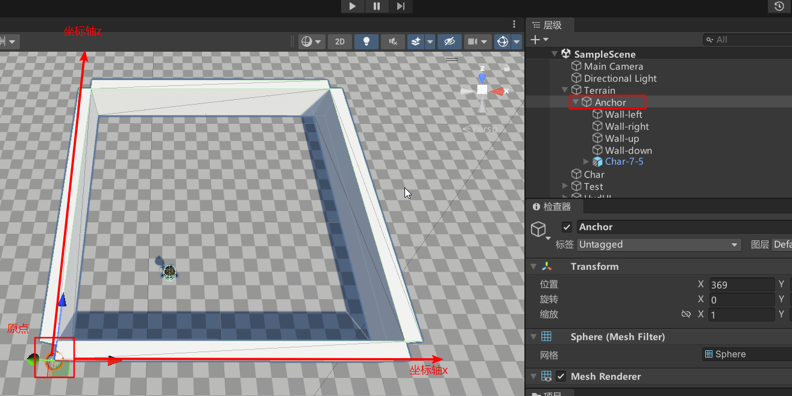
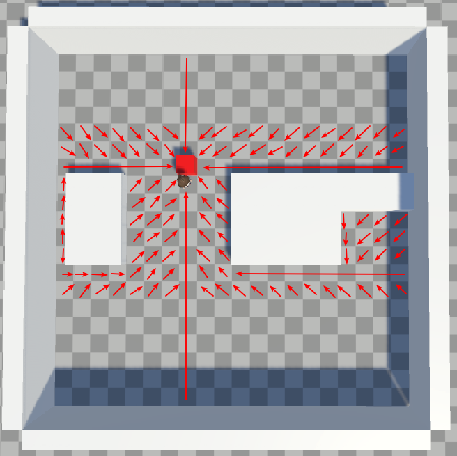

# PathfindingModule

author：张晓鹏

## 1. 概况

这里对A*算法寻路、FlowField流图算法寻路、路径射线追踪算法寻路进行实现。


## 2. 寻路之前的建图

建图需要关注的点：地图的坐标系、存储地图的数据结构。

下面以二维网格类型的地图为例。

### 2.1 地图的坐标系

地图中某个节点的位置怎么表达、多个点之间的相对位置怎么表达？我以一个权威参考点来对其进行统一的定位，这个“权威参考点"就是建立一个针对该地图的坐标系，而坐标系由坐标原点和坐标轴组成，所以就是确定该地图的坐标原点和坐标轴；有了地图坐标系就可以对地图中的每个点进行表达，从而可以获知节点的位置、两个节点的相对位置、两个节点的距离等信息。

如下图所示，建立一个空物体Anchor当锚点，以Anchor的本地坐标系的x轴和z轴建立坐标系：



### 2.2 存储地图的数据结构

这里直接用二维数组来存储对应格子的情况，如是否有障碍物以及障碍物的类型。


## 3. A*算法寻路

### 3.1 A* 算法的基本原理：

A*算法基于节点的三个评估值来进行路径搜索：

1. **g(n)**: 从起点到当前节点的花费。
2. **h(n)**: 当前节点n到目标节点的预估成本，通常使用欧几里得距离或曼哈顿距离来估算。
3. **f(n) = g(n) + h(n)**: 当前节点n的总估值，表示从起点到目标的预计总成本，A*算法会选择f(n)值最小的节点进行扩展。

本质上这是贪心的思路，使用f(n)来获取当前预估的最优的解来拓展新的节点。

### 3.2 A* 的工作流程：

1. 将起点加入优先队列，并以起点的的f(n)为排序规则进行优先队列的排序。
2. 从优先队列取出最优的节点, 该节点的f(n)最小, 即是当前评估的最接近终点的节点。
3. 从最优节点往外拓展其相邻的新节点, 拓展的新节点之前没拓展过, 或者当前的f(n)更优, 此时才将其加入优先队列。
4. 如果拓展到目标节点即找到最优解, 此时路径回溯即可获取最优路径；如果优先队列直到为空还未拓展到目标节点，即目标节点不可达，此时算法复杂度也退化成dfs了。

### 3.3 代码

核心伪代码：

```c#
//使用字典树模拟优先队列
var heap = new SortedDictionary<float, List<Vector2Int> >();
heap.add(起点);

while(heap.count > 0){
    var top = heap.First();
    
    if(top == 终点){
        break;
    }
    
    for(遍历top节点的相邻节点){
        计算相邻节点的f(n)并判断是否可以入队，可以的话就入队
    }
    
    如果找到终点=》最优路径回溯
}
```


实际实现的代码：

```c#
    public List<Vector2Int> startNavigation()
    {
        if (CharMgr.charList.Count <= 0) return null;

        var charac = CharMgr.charList[0].getGraphIdx();
        if (!charac.flag) return null;

        ///地图
        int[][] graph = GraphMgr.Instance.getGraph();
        ///使用字典树模拟堆/优先队列(key:当前移动距离+估值距离  val:当前位置)
        var heap = new SortedDictionary<float, List<Vector2Int>>();
        ///移动到Vector2的距离为float
        Dictionary<Vector2Int, float> dist = new Dictionary<Vector2Int, float>();
        ///路径记录 key的前一步为val
        Dictionary<Vector2Int, Vector2Int> path = new Dictionary<Vector2Int, Vector2Int>();

        ///起点
        Vector2Int start = Vector2Int.zero;
        ///终点
        Vector2Int target = Vector2Int.zero;

        for (int i = 0; i < graph.Length; i++)
        {
            for(int j = 0; j < graph[i].Length; j++)
            {
                //Debug.LogError(graph[i][j] + " " + (int)GraphObjType.Target);
                if (graph[i][j] == (int)GraphObjType.Char)
                {
                    start = new Vector2Int(i, j);
                }
                if (graph[i][j] == (int)GraphObjType.Target)
                {
                    target = new Vector2Int(i, j);
                }
            }
        }

        if(start == Vector2Int.zero ||  target == Vector2Int.zero)
        {
            //GraphMgr.Instance.prin();
            Debug.LogError("AStar寻路失败,地图中找不到起点或终点");
            return null;
        }

        ///加入起点
        List<Vector2Int> l = new List<Vector2Int>();
        l.Add(start);
        heap.Add(0, l);
        dist[start] = 0;

        ///开始AStar寻路
        while(heap.Count > 0)
        {
            ///取出堆顶元素
            var topAll = heap.First();
            var topList = topAll.Value;
            var topListVal = topList.First();
            topList.RemoveAt(0);

            if(topList.Count <= 0)
            {
                heap.Remove(topAll.Key);
            }

            Vector2Int preIdx = topListVal;
            float preDis = dist[preIdx];

            //到达终点
            if(preIdx == target)
            {
                break;
            }

            ///遍历相邻节点
            for(int i = 0; i < MoveDirec.dx.Length; i++)
            {
                int xx = preIdx.x + MoveDirec.dx[i];
                int yy = preIdx.y + MoveDirec.dy[i];

                if (graph[xx][yy] == (int)GraphObjType.Wall || graph[xx][yy] == (int)GraphObjType.Barrier)
                {
                    continue;
                }

                bool flag = true;
                ///对角线特殊判断
                if(i%2 == 1)
                {
                    int diagonal1 = (i - 1) % 8;
                    int diagonal2 = (i + 1) % 8;
                    List<int> diagonals = new List<int>();
                    diagonals.Add(diagonal1);
                    diagonals.Add(diagonal2);

                    foreach (var item in diagonals)
                    {
                        int temx = preIdx.x + MoveDirec.dx[item];
                        int temy = preIdx.y + MoveDirec.dy[item];

                        if (graph[temx][temy] == (int)GraphObjType.Wall || graph[temx][temy] == (int)GraphObjType.Barrier)
                        {
                            flag = false;
                            break;
                        }
                    }
                }
                if (!flag) continue;

                Vector2Int nexIdx = new Vector2Int(xx, yy);
                float nexDis = float.MaxValue;

                ///判断是否可以加入堆
                ///该相邻点为遍历过 或 评估值更优 =》 加入堆
                if(!dist.TryGetValue(nexIdx, out nexDis) || dist[nexIdx] > preDis + MathTool.getEuclideanDisV2(preIdx, nexIdx))
                {
                    nexDis = preDis + MathTool.getEuclideanDisV2(preIdx, nexIdx);
                    dist[nexIdx] = nexDis;
                    path[nexIdx] = preIdx;
                    if(!heap.TryGetValue(dist[nexIdx] + MathTool.getEuclideanDisV2(nexIdx, target), out var list))
                    {
                        list = new List<Vector2Int>();
                        list.Add(nexIdx);
                        heap.Add(dist[nexIdx] + MathTool.getEuclideanDisV2(nexIdx, target), list);
                    }
                    else
                    {
                        list.Add(nexIdx);
                    }
                }
            }
        }

        ///最优路径还原
        List<Vector2Int> ans = new List<Vector2Int>();
        Vector2Int curPoint = target;
        while(path.TryGetValue(curPoint, out Vector2Int prePoint))
        {
            ans.Add(prePoint);
            curPoint = prePoint;
        }

        if(ans.Count > 0 && ans[0] == target)
        {
            ans.RemoveAt(0);
        }

        return ans;
    }
```


### 3.3 视频演示

https://www.bilibili.com/video/BV17nPaeWEY2

<video src="README.assets/寻路模块-AStar寻路演示.mp4"></video>

https://www.bilibili.com/video/BV17EPaeRESJ

<video src="README.assets/寻路模块-AStar寻路演示2.mp4"></video>


## 4. FlowField流图算法寻路

### 4.1 使用情景

上面AStar寻路可以应用于单个角色（单个起点）的寻路情景，那若是多个角色还可以用AStar吗？用肯定是可以的，但多个角色时每个角色都得跑一遍自己的AStar寻路，而各自寻路过程中有可能路径是有重叠的，那么就会浪费一些时间了；对此，我们可以采用图形学里材质的思想，把需要的数据计算出来后存储起来，等要用的时候再查询即可，而不必重复计算，这就是FlowField流图算法的思路。

对于包含一个终点和多个障碍物的地图，地图上某个点的寻路方向是可以确定的，所以我们可以把所有点的寻路方向计算并存储起来，这样角色在寻路过程中只需要不断读取当前位置的寻路方向即可走到终点，如下图所示：



### 4.2 FlowField的工作流程

那么如何去“烘焙”得到这张寻路方向图呢？对地图上每个点走一遍AStar？no no no，这样就做了太多无用功了，我们可以逆向思考，直接从终点bfs即可在O(N) (N指地图的格子数量) 的时间复杂度内完成计算。

### 4.3 代码

核心的dfs代码如下：

```c#
    public void startNavigation()
    {
        if (CharMgr.charList.Count <= 0) return;

        ///地图
        int[][] graph = GraphMgr.Instance.getGraph();
        Queue<(int x, int z, int step)> que = new Queue<(int x, int z, int step)>();
        
        ///终点
        Vector2Int target = Vector2Int.zero;

        for (int i = 0; i < graph.Length; i++)
        {
            for (int j = 0; j < graph[i].Length; j++)
            {
                if (graph[i][j] == (int)GraphObjType.Target)
                {
                    target = new Vector2Int(i, j);
                }
            }
        }

        if (target == Vector2Int.zero)
        {
            //GraphMgr.Instance.prin();
            Debug.LogError("FlowField寻路失败,地图中找不到终点");
            this.flowFieldGraph = null;
            return;
        }

        this.resetFFGraph();

        que.Enqueue((target.x, target.y, 0));

        ///开始FlowField寻路
        while (que.Count > 0)
        {
            var top = que.Dequeue();

            int x = top.x;
            int z = top.z;
            int step = top.step;

            for(int ii = 0; ii < FlowField.dir.Length; ii++)
            {
                int i= FlowField.dir[ii];

                int xx = x + MoveDirec.dx[i];
                int zz = z + MoveDirec.dy[i];

                //已经搜索过
                if (this.flowFieldGraph[xx][zz] >= 0) continue;

                var type = GraphMgr.Instance.getVal(xx, zz);
                if (!(type == (int)GraphObjType.None || type == (int)GraphObjType.Char)) continue;
                ///此时格子是 None || Char


                ///对角线特殊判断
                bool flag = true;
                if (i % 2 == 1)
                {
                    int diagonal1 = (i - 1) % 8;
                    int diagonal2 = (i + 1) % 8;
                    List<int> diagonals = new List<int>();
                    diagonals.Add(diagonal1);
                    diagonals.Add(diagonal2);

                    foreach (var item in diagonals)
                    {
                        int temx = x + MoveDirec.dx[item];
                        int temz = z + MoveDirec.dy[item];

                        if (graph[temx][temz] == (int)GraphObjType.Wall || graph[temx][temz] == (int)GraphObjType.Barrier)
                        {
                            flag = false;
                            break;
                        }
                    }
                }
                if (!flag) continue;

                //记录方向
                this.flowFieldGraph[xx][zz] = (i + 4) % 8;

                que.Enqueue((xx, zz, step + 1));
            }
        }

        ///搜索第一层当成起点
        for (int ii = 0; ii < FlowField.dir.Length; ii++)
        {
            int i = FlowField.dir[ii];

            int xx = target.x + MoveDirec.dx[i];
            int zz = target.y + MoveDirec.dy[i];

            var type = GraphMgr.Instance.getVal(xx, zz);

            if (type == (int)GraphObjType.None || type == (int)GraphObjType.Char)
            {
                this.flowFieldGraph[xx][zz] = -1;
            }
        }

    }
```

### 4.4 视频演示

https://www.bilibili.com/video/BV1EEPaeREA2

<video src="README.assets/寻路模块-FlowField.mp4"></video>


## 5. 路径射线追踪算法寻路

在网上我还看到一种简单粗暴的寻路思路，记录终点的运动轨迹，如何起点向终点的运动轨迹打射线，如果可达就向该方向运动。

该方案由于不考虑最短路径以及不一定能找到可达路径，所以适用范围较窄。

下面以跟随宠物的场景应用该寻路算法。

### 5.1 工作流程

角色移动时记录角色的移动轨迹。

宠物向角色的移动轨迹打射线，可达就往该方向移动。

### 5.2 代码

核心代码：

```c#
    void Update()
    {
        if(!this.isFollow)
        {
            return;
        }

        ///获取角色路径
        LinkedList<Vector3> path = RayCast.instance.getPath();

        if (path == null || path.Count == 0)
        {
            return;
        }

        Vector3 charCurGraphIdx = path.First.Value;
        Vector3 charCurWorldPos = GraphMgr.Instance.localPos2WorldPos(charCurGraphIdx);
        if(MathTool.getEuclideanDisV3(charCurWorldPos, transform.position) <= 1)
        {
            return;
        }

        ///从前往后遍历角色路径，打射线判断当前位置时候可达
        foreach(Vector3 charGraphIdx in path)
        {
            Vector3 charLocalCenterPos = new Vector3(charGraphIdx.x+0.5f, 0, charGraphIdx.z+0.5f);
            Vector3 charWorldPos = GraphMgr.Instance.localPos2WorldPos(charLocalCenterPos);

            Vector3 rayStar = new Vector3(transform.position.x, 0.5f, transform.position.z);
            Vector3 rayEnd = new Vector3(charWorldPos.x, 0.5f, charWorldPos.z);

            if (!Physics.Linecast(rayStar, rayEnd))
            {
                Debug.DrawLine(rayStar, rayEnd, Color.green);
                //可达，并往该方向移动
                Vector3 dir = (charWorldPos - transform.position).normalized;
                transform.Translate(dir*1.2f*Time.deltaTime, Space.World);

                break;
            }
            else
            {
                Debug.DrawLine(rayStar, rayEnd, Color.red);
                //不可达
            }
        }
    }
```

### 5.3 视频演示

视频中我通过键盘操控角色的移动，而后方的宠物(胶囊体模拟)通过射线追踪跟随：

https://www.bilibili.com/video/BV1BEPaeREzy

<video src="README.assets/寻路模块-路径射线追踪.mp4"></video>
